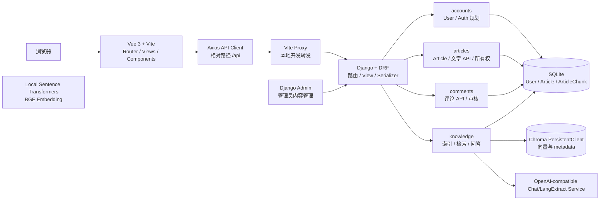
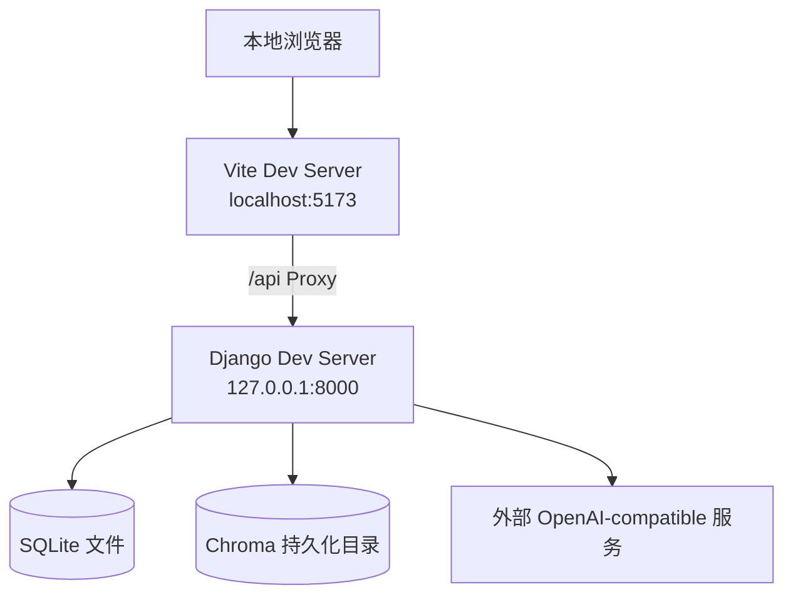
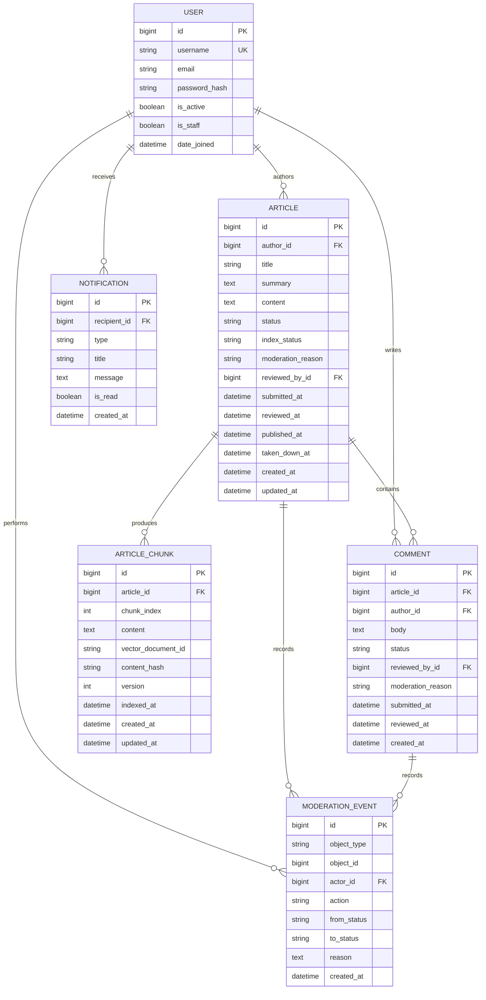
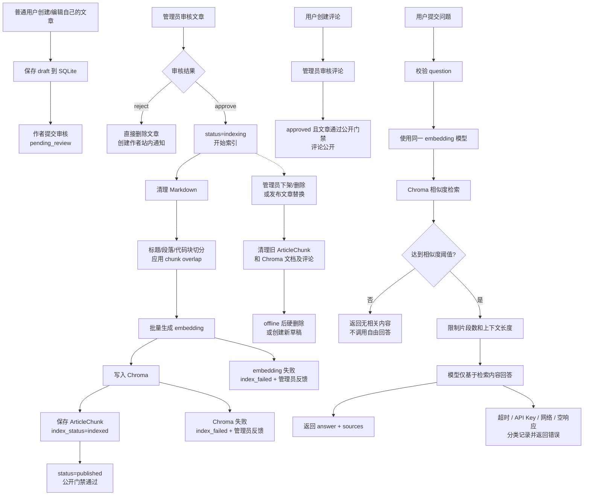
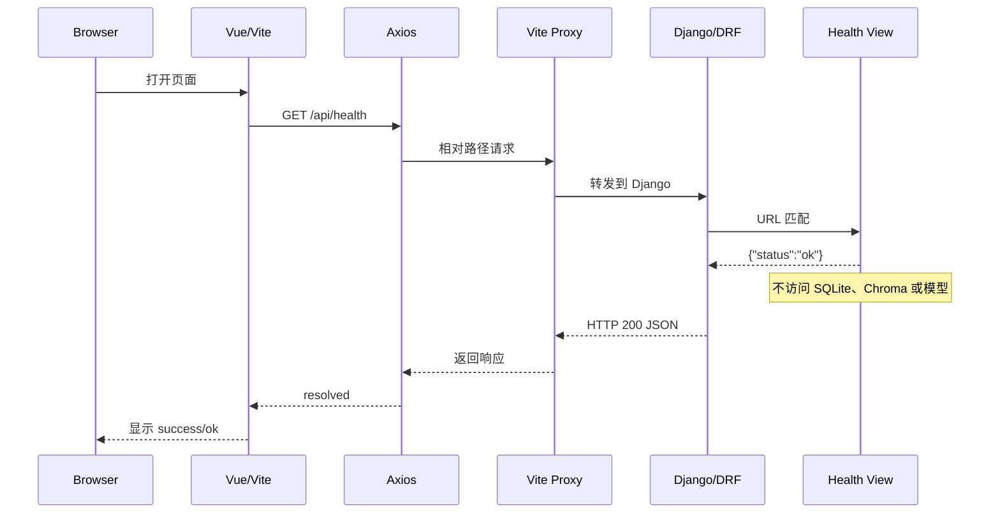

# OwnerBlog 项目开发规范

- 文档状态：`planned`（项目技术基线，代码实现尚未开始）
- 适用范围：OwnerBlog 全项目及后续 Phase
- Phase 1 实现范围：[Phase 1 MVP 计划](../plan/phase1-mvp.md)
- 当前执行任务：[Day 1 计划](../plan/day1.md)

## 1. 文档目的与权威关系

本文档定义 OwnerBlog 跨阶段稳定的技术规则，包括组件边界、总体架构、技术栈、数据模型、核心数据流、API 契约、安全边界、主要技术能力和质量要求。

本文档不是某一天的任务清单，也不表示其中的组件已经全部实现。当前代码仓库处于设计阶段，所有未标记为 `implemented` 的内容均属于规划。

项目文档职责如下：


| 文档                                  | 职责                               |
| ----------------------------------- | -------------------------------- |
| `docs/development-specification.md` | 全项目唯一技术规范，定义长期架构、组件、数据流、接口和技术能力  |
| `plan/project-plan.md`              | Phase 1-5 的长期路线、阶段目标、进入条件和演进方向   |
| `plan/phase1-mvp.md`                | Phase 1 的功能范围、排除项、一周计划、降级规则和阶段验收 |
| `plan/day1.md`                      | Day 1 的具体任务、学习内容、开发顺序和当日验收       |
| `README.md`                         | 项目简介、环境、启动命令和运行索引，不复制完整技术契约      |


状态标记约定：

- `planned`：设计中，代码尚未实现。
- `phase1`：Phase 1 必须实现的能力或约束。
- `future`：后续 Phase 再实现的能力。
- `implemented`：代码已经实现并通过对应验收；当前尚无此状态内容。


## 2. 产品边界与核心闭环

OwnerBlog 面向个人技术内容沉淀、管理、展示和知识库问答。

```text
测试账号登录
  -> 创建自己的文章草稿
      -> 提交审核
          -> 管理员审核通过
              -> 同步索引流水线
                  -> embedding 成功
                      -> Chroma 写入成功
                          -> 文章公开展示
                              -> 登录用户发表评论
                                  -> 管理员审核评论
                                      -> 通过后评论公开
                                          -> 用户提交问题
                                              -> 检索相关文章片段
                                                  -> 模型基于检索上下文生成回答
                                                      -> 返回回答和来源片段
```


### 2.1 角色边界

- 匿名访客可以阅读通过公开门禁的文章和评论，并且无需登录即可调用公开知识库问答；不能写入任何内容。
- Phase 1 不实现注册。测试用户由管理员或后端命令创建；普通用户登录后可以创建和提交自己的文章，也可以发表评论。
- 普通用户可以编辑自己的草稿；文章提交审核后不可编辑。已发布文章没有原地编辑，用户只能删除旧文章后重新创建并提交新文章。
- 管理员负责账号和内容审核，可以对所有文章和评论执行通过、驳回、下架、删除等操作；普通用户不能审核自己的内容。
- 管理员负责内容审核、索引运维、账号启停和 Phase 1 所需的全部后台操作。
- 超级管理员不是产品角色，不进入 Phase 1 权限矩阵；开发者仅为维护源码和环境保留 Django `createsuperuser` 能力。
- 普通用户使用 Vue + REST API；Django Admin 只作为管理员的管理入口。

Phase 1 只创建普通用户和管理员两类产品角色。管理员通过 Django Groups、permissions 和 Django Admin 落地；不实现独立 Vue 管理台，也不实现 `/api/admin/*` 管理 API。开发者使用 Django `createsuperuser` 创建或维护后台入口，但该账号属于开发维护身份，不作为产品角色、权限矩阵或业务流程的一部分。MVP 不创建审核员、超级管理员或其他管理员层级。

### 2.2 Phase 1 适用范围

Phase 1 必须完成认证、普通用户投稿、文章审核、审核后索引和公开展示、评论基础能力、对象级权限、站内系统通知、无需登录即可调用的公开知识库单轮问答、来源返回和基础异常提示。问答不因登录而扩大可见范围；只有管理员审核通过、embedding 成功且 Chroma 写入成功的文章才能通过公开门禁进入公开 API 和知识库。具体范围以 `plan/phase1-mvp.md` 为准。

Phase 1 仍不做注册、复杂搜索、点赞收藏、邮件/短信通知、Agent、多轮对话、流式输出、Celery、Chroma HTTP Server 和完整 Docker Compose。

## 3. 总体系统架构


### 3.1 逻辑架构




### 3.2 本地部署拓扑




当前 `backend/` 和 `frontend/` 已创建并可运行。Django 后端、Vue/Vite 前端、Vite Proxy、认证基础能力、文章模型、文章 API、个人草稿管理、提交审核和 `/api/health` 联调链路已经完成；ArticleChunk 数据模型和 RAG 配置已准备。Markdown 清洗、切分、embedding、Chroma、问答 API 和审核后的自动索引发布仍按后续步骤接入。

## 4. 前后端边界与交互契约


### 4.1 边界定义

前端和后端通过 HTTP/JSON API 隔离，前端不能直接访问数据库、Chroma、模型服务或 Django ORM。

```text
Vue 页面/组件
  -> Axios API Client
      -> /api HTTP/JSON 契约
          -> Django/DRF Router
              -> Serializer / Permission
                  -> Domain Service
                      -> SQLite / Chroma / Model Service
```


### 4.2 前端职责

- 页面路由、组件组合、表单输入和页面状态管理。
- 通过 Axios 调用后端 API，并处理 `loading`、`success`、`empty`、`error` 和 `submitting` 状态。
- 根据当前用户、资源作者和资源状态决定是否显示编辑、删除、提交审核等入口。
- 渲染后端返回的文章、评论、问答回答、来源和站内通知。
- 对 Markdown 执行安全渲染，不信任服务端或用户提交的原始 HTML。
- 前端隐藏按钮只改善交互体验，不承担最终权限判断。

前端禁止：

- 直接连接 SQLite、Chroma 或模型服务。
- 在浏览器中保存或使用模型 API Key。
- 自行修改 `author`、`status`、`index_status`、审核人或角色字段。
- 自行判断文章是否公开并绕过后端公开门禁。
- 在组件中实现 embedding、Chroma 写入、RAG 检索、Prompt 拼接或索引清理。


### 4.3 后端职责

- 提供认证、Session/Cookie、CSRF、角色权限和对象级所有权校验。
- 校验请求参数、查询资源存在性、校验实体关联关系并返回稳定 JSON 响应。
- 统一执行文章公开门禁：`status=published AND index_status=indexed`。
- 执行文章、评论审核和站内通知写入。
- 编排文章索引、embedding、Chroma 清理/重建和问答检索。
- 保护模型 API Key，并将外部服务错误转换为用户可理解的错误码。
- 通过 Django Admin 提供管理员审核和索引运维入口。

后端禁止：

- 把业务权限判断交给前端。
- 让 API 直接信任客户端提交的作者、状态、审核人或索引状态。
- 在 API View 中堆放 Markdown 切分、Chroma 操作、Prompt 拼接和重试逻辑。
- 向匿名用户或普通用户返回草稿、待审、索引失败、下架或已删除文章。


### 4.4 API 交互规则

- 所有业务接口使用 `/api/` 前缀和 JSON 请求/响应。
- 前端使用相对路径，例如 `/api/articles`，本地通过 Vite Proxy 转发到 Django。
- 成功响应提供稳定字段；错误响应统一包含 `error.code` 和 `error.message`。
- 匿名用户可以读取公开文章、已通过评论和使用公开知识库问答；所有写接口必须登录。
- 登录不会扩大问答检索范围；问答回答和 `sources` 只能来自公开门禁通过的文章。
- 前端不根据 HTTP 状态自行推断业务成功，必须依据后端响应结构处理结果。


### 4.5 权限和删除边界

- 前端依据用户信息和资源信息隐藏无权限入口。
- 后端每次执行最终认证、资源存在性、所有权/管理员权限和关联关系校验。
- 删除由后端统一编排：清理 ArticleChunk 和 Chroma 向量成功后，才执行数据库硬删除。
- 前端不得直接调用 Chroma 清理或数据库删除能力。


### 4.6 典型请求链路

公开文章读取：

```text
Vue -> Axios -> Django/DRF -> 公开门禁查询 -> SQLite -> JSON -> Vue 渲染
```

知识库问答：

```text
Vue -> Axios -> Django/DRF -> 待实现的公开文章片段检索 -> embedding/Chroma
     -> GPT-compatible Model -> answer + sources -> Vue 渲染
```

当前 `/knowledge` 页面和前端请求封装已存在，但后端问答接口尚未实现。

文章删除：

```text
Vue 删除操作 -> Django/DRF -> 登录认证 -> 资源/所有权/关联校验
              -> ArticleChunk/Chroma 清理 -> 数据库硬删除 -> JSON 结果
```


### 4.7 Phase 1 边界与不做清单

本节是项目规范中对 Phase 1 边界的独立摘要，用于防止跨层实现和范围膨胀。具体日期任务、执行顺序、降级规则和逐项验收仍以 `[plan/phase1-mvp.md](../plan/phase1-mvp.md)` 为准。

#### Phase 1 必须包含

- Django Session/Cookie 登录、退出和基础角色权限；测试账号由管理员或后端命令创建。
- 普通用户创建文章草稿、编辑草稿、提交审核和删除自己的文章。
- 管理员通过 Django Admin 审核、通过、驳回、下架和删除文章与评论。
- 文章审核通过后执行 embedding 和 Chroma 索引；只有索引成功的文章公开。
- `index_status` 必填，并向管理员反馈 embedding、Chroma 和索引整体状态。
- 公开文章列表、详情、已通过评论和匿名知识库问答。
- 登录用户发表评论；评论审核通过后公开。
- 文章和评论审核结果的站内系统通知。
- 问答返回回答和公开文章来源片段。
- 认证、所有权、资源存在性、关联关系、删除清理和异常处理。


#### Phase 1 明确不做

- 公开注册、邮箱验证、找回密码和复杂账号体系；测试账号通过管理员或后端命令创建。
- 独立 Vue 管理后台；管理员只使用 Django Admin。
- 普通用户审核、修改审核状态、修改作者或修改索引状态。
- 已发布文章原地编辑；编辑入口只能删除旧文章并创建新草稿。
- 审核驳回后的内容恢复、修改后重提或回收站恢复。
- 软删除和恢复机制；文章、评论和 offline 内容确认后硬删除。
- 匿名用户投稿、评论、删除或其他写操作。
- 私信、邮件、短信、推送通知；只做站内审核结果通知。
- 评论进入文章索引或影响文章发布和知识库问答。
- 复杂分页、高级搜索、分类/标签筛选页面、点赞、收藏、订阅和推荐。
- Agent、多轮对话、流式输出、AI 自动发布或绕过审核覆盖原文。
- Celery、Redis、Chroma HTTP Server、PostgreSQL/pgvector 和完整 Docker Compose 交付。

Phase 1 的核心完成条件是文章审核、索引、公开门禁和问答链路稳定；评论是其后的附属闭环，不能阻塞文章发布、索引或问答。

### 4.8 角色与权限矩阵

本矩阵是 Phase 1 唯一的产品角色权限定义。匿名访客是访问状态，不是账号角色；开发者维护身份和 Django `superuser` 能力不属于产品权限模型。


| 能力              | 匿名访客   | 普通用户     | 管理员     |
| --------------- | ------ | -------- | ------- |
| 阅读通过公开门禁的文章     | 是      | 是        | 是       |
| 阅读所属公开文章下的已通过评论 | 是      | 是        | 是       |
| 调用公开知识库问答       | 是，无需登录 | 是，范围不扩大  | 是，范围不扩大 |
| 查看自己的资料和文章      | 否      | 是        | 是       |
| 创建文章草稿          | 否      | 是        | 是，可管理全量 |
| 编辑文章草稿          | 否      | 仅自己的草稿   | 是，可管理全量 |
| 提交文章审核          | 否      | 仅自己的文章   | 是，可管理全量 |
| 删除文章            | 否      | 仅自己且状态允许 | 是，可管理全量 |
| 创建评论            | 否      | 是        | 是       |
| 删除评论            | 否      | 仅自己的评论   | 是，可管理全量 |
| 审核文章和评论         | 否      | 否        | 是       |
| 查看和处理索引状态       | 否      | 否        | 是       |
| 重建文章索引          | 否      | 否        | 是       |
| 管理测试账号启停        | 否      | 否        | 是       |


权限执行规则：

- 前端根据当前用户和资源信息隐藏没有权限的按钮、菜单和入口。
- 后端必须再次执行登录认证、角色校验、资源存在性查询、所有权校验、状态校验和关联关系校验。
- 普通用户不能提交或覆盖 `author`、`status`、`index_status`、审核人和角色权限字段。
- 管理员通过 Django Admin 执行审核、删除、索引查看和索引重建，不创建独立管理前端。
- 问答接口对三类访问者均开放，但所有访问者只能检索通过公开门禁的文章。


## 5. 技术栈与技术决策


| 层次       | 技术                              | 状态      | 决策                                          |
| -------- | ------------------------------- | ------- | ------------------------------------------- |
| 语言       | Python 3.x                      | planned | 后端与 AI 能力统一使用 Python 生态                     |
| 后端       | Django + Django REST Framework  | phase1  | 使用 Django Admin、ORM 和清晰的 REST API 边界        |
| 前端       | Vue 3 + Vite                    | phase1  | 使用单文件组件和本地开发服务器                             |
| 路由       | Vue Router                      | phase1  | 管理文章列表、详情和问答页面路由                            |
| HTTP 客户端 | Axios                           | phase1  | 统一 API 请求和错误处理                              |
| 状态管理     | Vue `ref`/组合式状态                 | phase1  | Phase 1 暂不强制引入 Pinia，认证状态可由轻量 composable 管理 |
| 数据库      | SQLite                          | phase1  | 降低本地开发和学习成本，使用 Django migrations 建表         |
| 文档解析    | MinerU                           | planned | 解析 PDF 等原始文档并输出 Markdown/JSON                         |
| 结构化抽取  | LangExtract                     | planned | 抽取章节、主题、实体和原文位置 metadata                        |
| 向量库      | Chroma PersistentClient         | phase1  | 本地嵌入式向量存储，不作为高并发生产方案                        |
| 模型       | OpenAI-compatible SDK/API       | phase1  | 通过环境变量配置服务地址、密钥和模型                          |
| 测试       | pytest、pytest-django            | phase1 | 已有文章权限、审核和公开读取测试；RAG 关键测试待补齐                          |
| 日志       | Python logging / Django logging | phase1  | 记录索引、模型调用和错误分类，不记录密钥                        |
| 容器化      | Docker Compose                  | future  | 长期工程化能力，不作为 Phase 1 完成门槛                    |


### 4.1 技术决策规则

- 先使用满足当前功能的最小技术栈，不为展示技术名词提前引入基础设施。
- 依赖版本写入 `requirements.txt` 和 `package-lock.json`，不要在多个文档中维护不同版本。
- Phase 1 使用 Django migrations 创建和更新 SQLite 表结构；不手工提交 `db.sqlite3`，也不在本阶段制定生产数据库升级策略。
- Phase 1 暂不引入 Pinia。只有出现认证状态、跨页面会话或复杂共享状态时，才通过 ADR 评估引入。
- Docker Compose、Redis、Celery、Chroma HTTP Server 和 PostgreSQL/pgvector 属于后续扩展，不改变当前核心闭环。


## 6. 前端组件与页面规范


### 5.1 页面层


| 路由               | 页面                  | 职责                  | 状态     |
| ---------------- | ------------------- | ------------------- | ------ |
| `/`              | `ArticleListView`   | 获取并展示已发布文章列表        | 已实现 |
| `/articles/:id`  | `ArticleDetailView` | 获取并展示文章详情和 Markdown | 已实现 |
| `/knowledge`     | `KnowledgeView`     | 提交问题、展示回答和来源        | 页面已实现，后端问答待接入 |
| `/login`         | `LoginView`         | 登录和会话状态             | 已实现 |
| `/my-articles`   | `MyArticlesView`    | 创建、编辑、删除草稿并提交审核 | 已实现 |


页面负责组合数据和页面状态，不直接实现 Markdown 清洗、RAG 检索或模型调用。

### 5.2 公共组件

规划的 `frontend/src/components/` 组件：

- `ArticleCard`：展示标题、摘要、发布时间和详情入口。
- `LoadingState`：统一 loading 状态。
- `EmptyState`：列表为空或知识库无结果时的提示。
- `ErrorState`：网络、接口或模型错误提示。
- `SourceList`：展示来源文章标题、片段和 chunk 信息。
- `MarkdownContent`：使用安全策略渲染 Markdown 内容。

公共组件只负责展示和用户事件，不直接创建 Axios 请求。

### 5.3 API、路由和状态

- `src/api/` 创建 Axios 实例，使用相对 `/api` 路径。
- `src/router/` 集中维护路由和动态参数。
- `src/views/` 负责调用 API、组合组件和维护页面级状态。
- Phase 1 优先使用页面内 `ref` 和组合式函数，不建立全局 store。
- 页面至少区分 `loading`、`success`、`empty`、`error` 和 `submitting`。
- 问答提交期间禁用按钮，防止重复请求；请求结束后恢复。
- 前端不硬编码完整后端地址，不把服务端 API Key 放入任何 `VITE_` 变量。


### 5.4 前端安全规范

- Markdown 原文必须经过安全渲染，不直接注入未经清洗的 HTML。
- API 返回的错误信息要对用户可理解，内部堆栈只进入后端日志。
- 问答输入设置最大长度，避免无界请求和上下文膨胀。
- UI 组件库不是 Phase 1 必需项；引入新库必须说明收益和维护成本。


## 7. 后端组件、模块职责与依赖方向


### 6.1 分层约定

```text
URL Router
  -> View / APIView
      -> Serializer / 参数校验
          -> Domain Service
              -> ORM / Chroma / LLM Adapter
```

- Router：只负责 URL 到 view 的映射。
- View/APIView：负责 HTTP 协议适配、认证检查、调用 service 和错误映射。
- Serializer：负责请求字段校验和响应结构约束。
- Service：负责领域流程和跨组件编排。
- ORM/Adapter：负责数据库、Chroma 和外部模型服务的具体访问。

View 不直接堆放 Markdown 切分、Chroma 操作、prompt 拼接和重试逻辑。

### 6.2 模块职责


#### `config`

- Django settings、环境变量读取、日志和数据库配置。
- 根路由和全局 API 配置。
- 不包含文章或 RAG 业务逻辑。


#### `accounts`

- 优先复用 Django User 或 AbstractUser。
- 提供登录、退出和当前用户能力；Phase 1 不提供公开注册接口。
- 通过 Django Groups 和细粒度 permissions 区分普通用户和管理员。
- Session/Cookie 和 CSRF 负责认证；普通用户不进入 Django Admin。
- 通过对象级权限保护文章、评论和账号字段。


#### `articles`

- Article、分类和标签等内容实体。
- 文章所有权、草稿、待审核、索引中、公开、下架和硬删除流程。
- 普通用户创建草稿、编辑草稿、提交审核和删除自己的文章；管理员全量审核、下架、删除。
- 已公开且已索引文章的列表和详情 API。
- 文章状态变化触发知识库索引更新、清理或禁用。
- 发布后的“编辑”入口执行删除旧文章并创建新草稿，不更新原文章。

`articles` 不直接负责 embedding、Chroma 读写和模型 prompt。

#### `comments`

规划文件职责：

```text
comments/models.py        Comment / moderation fields
comments/serializers.py   请求校验和响应结构
comments/views.py         评论列表、创建、本人删除
comments/permissions.py   owner/admin 对象级权限
comments/admin.py         管理员审核入口
comments/tests.py         评论审核和越权测试
```

只有已通过、所属文章通过公开门禁的评论才展示；评论提交后不能由普通用户修改，删除后不可恢复。

#### `knowledge`

规划文件职责：

```text
knowledge/models.py     ArticleChunk（phase1）
knowledge/services.py   清洗、切分、索引、更新、删除和检索
knowledge/llm.py        embedding 和 chat 模型适配
knowledge/views.py      问答 API 编排
knowledge/tests.py      RAG 关键测试
```

`knowledge` 目录目前已完成 `ArticleChunk` 数据模型和 migration；下面的原始文档解析、结构化抽取、service、模型适配器、问答 API 和 RAG 测试仍是待实现文件。建议按 [RAG 全链路开发指引](rag-development-guide.md) 的顺序逐步补齐：

#### `Django Admin`

- Phase 1 的文章管理入口。
- 需要 Django Session 和 staff/admin 权限。
- 不开发 Vue 管理后台。
- 管理员在 Admin 中查看待审核内容、执行通过/驳回/下架/删除，并查看索引阶段、失败原因和重建索引操作。


### 6.3 依赖方向

允许：

```text
config -> all modules
articles -> knowledge.services（触发索引用例）
knowledge -> Article / ArticleChunk ORM
views -> serializers -> services
```

禁止：

- `articles` 在 model 或 view 中直接调用外部模型 SDK。
- `knowledge` 反向依赖 Vue 或浏览器组件。
- API view 复制完整的索引和问答流程。
- 配置模块保存业务状态。


## 8. 数据模型、生命周期与一致性


### 7.1 Article


| 字段                  | 说明                                                                         |
| ------------------- | -------------------------------------------------------------------------- |
| `id`                | 主键                                                                         |
| `author_id`         | 作者，只能由服务端从当前用户确定                                                           |
| `title`             | 文章标题                                                                       |
| `summary`           | 列表摘要                                                                       |
| `content`           | Markdown 原文                                                                |
| `status`            | `draft`、`pending_review`、`indexing`、`index_failed`、`published` 或 `offline` |
| `submitted_at`      | 提交审核时间                                                                     |
| `reviewed_at`       | 最近审核时间                                                                     |
| `published_at`      | 公开时间                                                                       |
| `taken_down_at`     | 下架时间                                                                       |
| `reviewed_by_id`    | 审核管理员                                                                      |
| `taken_down_by_id`  | 执行下架的管理员                                                                   |
| `moderation_reason` | 驳回或下架原因                                                                    |
| `created_at`        | 创建时间                                                                       |
| `updated_at`        | 修改时间                                                                       |


索引状态是必填字段，不能为 NULL：

```text
index_status: not_indexed | indexing | indexed | failed | stale
index_step: pending | embedding | chroma | completed
index_error, embedding_error, chroma_error, indexed_at, content_hash, version
```

状态流：

```text
draft -> pending_review -> indexing -> published
indexing -> index_failed -> indexing
published -> offline
draft/pending_review/index_failed/offline -> hard delete
```

普通用户的“发布”表示提交审核；管理员通过后进入索引流程，只有审核通过且 `index_status=indexed` 才能进入 `published`。embedding 或 Chroma 任一步失败时，文章不公开，保留为 `index_failed` 供管理员处理。普通用户不能编辑已提交或已发布文章；已发布文章的编辑入口执行“确认删除旧文章并创建新草稿”。文章和评论删除均为硬删除，不提供恢复机制；删除前必须二次确认并提示不可恢复。

字段归属约定：Article 负责文章生命周期和索引生命周期，包括 `status`、`index_status`、`index_step`、错误字段、`content_hash`、`version` 和索引时间；ArticleChunk 只负责文章切片和 Chroma 映射，不重复保存文章状态。

### 7.2 Comment


| 字段                  | 说明                                    |
| ------------------- | ------------------------------------- |
| `id`                | 主键                                    |
| `article_id`        | 所属文章                                  |
| `author_id`         | 评论作者，由服务端确定                           |
| `body`              | 评论内容                                  |
| `status`            | `pending_review`、`approved`、`offline` |
| `submitted_at`      | 提交审核时间                                |
| `reviewed_at`       | 最近审核时间                                |
| `reviewed_by_id`    | 审核管理员                                 |
| `moderation_reason` | 驳回或下架原因                               |
| `created_at`        | 创建时间                                  |


只有 `approved` 且所属文章通过公开门禁的评论公开。评论驳回、下架或用户删除时直接从数据库删除，并向评论作者写入一条站内系统通知；通知不包含被驳回内容的正文。

### 7.3 ModerationEvent

Phase 1 必须保留 ModerationEvent 审核审计实体或等价的持久化日志：

```text
object_type, object_id, actor_id, action
from_status, to_status, reason, created_at
```

至少记录管理员通过、驳回、下架和删除的操作人、时间和原因。被硬删除的内容不保留可恢复副本；审核事件仅保留必要的对象 ID、动作和元数据。

### 7.4 Notification

Phase 1 只实现站内系统通知，不实现邮件、短信或推送通知：

```text
id, recipient_id, type, title, message, is_read, created_at
```

- 文章或评论审核不通过、文章下架时，向作者创建通知。
- 通知只说明处理结果和必要的时间，不展示被删除内容的正文、审核细节或可恢复入口。
- embedding/Chroma 失败只通知管理员，不通知普通用户；这是技术处理状态。
- 前台提供通知列表或未读数量入口，管理员也可在 Django Admin 查看索引错误。


### 7.5 ArticleChunk


| 字段                   | 说明           |
| -------------------- | ------------ |
| `id`                 | 主键           |
| `article_id`         | 所属 Article   |
| `chunk_index`        | 文章内顺序        |
| `content`            | 清洗和切分后的文本    |
| `vector_document_id` | Chroma 文档 ID |
| `created_at`         | 创建时间         |
| `updated_at`         | 更新时间         |


必须建立：

```text
unique(article_id, chunk_index)
```

SQLite 保存片段映射和可追踪业务数据；Chroma 保存向量和检索 metadata。

### 7.6 User

优先使用 Django 内置 User 或 AbstractUser：

- `id`、`username`、`email`
- Django 密码哈希
- `is_staff`、`is_active`
- `date_joined`、`last_login`
- 角色通过 Groups 和 permissions 管理

默认停用用户而不是物理删除账号。作者和审核人关系使用 `PROTECT` 或匿名化策略，避免删除用户破坏内容和审核审计。

### 7.7 实体关系图




ER 图说明：

- 一个 User 可以创建多篇 Article、发表多条 Comment，并执行多条审核事件。
- 一篇 Article 可以包含多条 Comment 和多个 ArticleChunk。
- `ARTICLE_CHUNK` 与 `ARTICLE` 是一对多关系，且 `article_id + chunk_index` 必须联合唯一。
- `MODERATION_EVENT` 采用 `object_type + object_id` 的通用对象关联，同时通过 `actor_id` 关联执行操作的 User；它可以记录 Article 和 Comment 的审核历史。
- `reviewed_by_id`、`taken_down_by_id` 和 `deleted_by_id` 都应关联 User，但为避免图中重复 User 关系，仅在字段中标注 FK。
- Chroma 中的向量实体不在 SQLite ER 图中，`vector_document_id` 是 ArticleChunk 到 Chroma 文档的映射。


### 7.7 生命周期和一致性规则

```text
draft
  -> pending_review：作者提交审核
pending_review
  -> indexing：管理员通过，开始索引
indexing
  -> published：embedding 和 Chroma 均成功
indexing
  -> index_failed：embedding 或 Chroma 失败
index_failed
  -> indexing：管理员重建索引
published
  -> offline：管理员下架
draft/pending_review/index_failed/offline
  -> hard delete：作者或管理员确认删除
```

公开文章、文章详情和 RAG 检索统一通过同一个公开门禁，必须同时满足：

```text
status = published
AND index_status = indexed
```

`GET /api/articles` 和 `GET /api/articles/{id}` 都调用公开门禁查询，不能只判断 `status=published`。评论公开还必须额外满足 `comment.status=approved`。匿名用户只能通过 GET 读取公开文章和评论；所有写入接口要求登录。

`POST /api/knowledge/chat` 允许匿名用户访问，但检索集合只能包含通过公开门禁的文章片段。回答和 `sources` 必须全部来自公开文章；草稿、待审核、索引失败、下架或已删除文章不得参与检索，也不得出现在来源中。登录用户与匿名用户使用同一公开检索范围，登录不会扩大问答可见范围。

索引流程必须具备幂等性：同一文章重复索引不应留下旧片段或重复 chunk；embedding 和 Chroma 失败必须分别记录进度、错误和管理员通知，不能静默标记为成功。评论不进入知识库索引。

管理员下架或删除文章时，必须清理对应 ArticleChunk 和 Chroma 文档；硬删除文章时同时删除评论。文章驳回时直接删除文章并向作者创建站内通知。

## 9. 核心数据流


### 8.1 发布、索引和问答




### 8.2 Health 请求




Django 停止时：Proxy 连接失败 → Axios rejected → Vue 显示 error。Health 是通用基础探针，不承担业务检查。

## 10. API 契约与认证边界


### 9.1 URL 和响应约定

- 公开 API 使用 `/api/` 前缀。
- 资源使用名词路径，动作型能力使用明确的动作路径，例如 `/api/knowledge/chat`。
- JSON 字段使用 `snake_case`。
- 成功响应返回稳定结构；错误响应至少包含机器可识别的 `code` 和用户可理解的 `message`。
- 公开接口不泄露草稿、待审核、驳回或下架内容是否存在。
- 所有内容写入接口都执行认证和对象级权限校验：匿名请求返回 `401`，登录但无权限返回 `403`，为防止 ID 探测可对跨用户资源统一返回 `404`。`POST /api/knowledge/chat` 不写入业务数据，按匿名可访问的问答接口处理。
- 状态、作者、审核人、角色和权限字段由服务端维护，客户端不能直接提交或覆盖。
- 前端只为有权限且当前状态允许删除的用户渲染删除入口；隐藏按钮只是体验层控制，后端 API 必须再次执行认证、对象所有权、管理员角色和状态校验。

所有删除接口必须遵循固定后端链路：

```text
登录认证
  -> 查询资源是否存在
      -> 校验当前用户是资源作者或管理员
          -> 校验资源与所属 Article、ArticleChunk、Chroma 映射的关联关系
              -> 清理 ArticleChunk 和 Chroma 向量
                  -> 硬删除数据库资源及允许级联删除的关联评论
```

资源不存在或用户无权访问时不得执行清理和删除；对跨用户资源可统一返回 `404`，避免泄露资源存在性。删除文章必须处理所属评论、ArticleChunk 和 Chroma 文档；删除评论只处理该评论，不得影响所属文章、其他评论或文章索引。Chroma 清理失败时记录管理员可见错误并停止最终数据库删除，避免留下无法追踪的向量数据。

### 9.2 API 清单


#### 认证


| 方法     | 路径                 | 用途                   | 登录要求 |
| ------ | ------------------ | -------------------- | ---- |
| `POST` | `/api/auth/login`  | 创建 Session 登录        | 不需要  |
| `POST` | `/api/auth/logout` | 注销当前 Session         | 需要登录 |
| `GET`  | `/api/auth/me`     | 获取当前用户和角色            | 需要登录 |
| `GET`  | `/api/auth/csrf`   | 获取 CSRF token（如实现需要） | 按实现  |


#### 公开和用户文章


| 方法       | 路径                                 | 用途             | 登录要求        |
| -------- | ---------------------------------- | -------------- | ----------- |
| `GET`    | `/api/articles`                    | 已公开且已索引文章列表    | 不需要         |
| `GET`    | `/api/articles/{id}`               | 已公开且已索引文章详情    | 不需要         |
| `GET`    | `/api/my-articles`                 | 当前用户自己的文章      | 需要登录        |
| `POST`   | `/api/articles`                    | 创建自己的草稿        | 需要登录        |
| `PATCH`  | `/api/articles/{id}`               | 仅编辑自己的草稿       | owner       |
| `DELETE` | `/api/articles/{id}`               | 删除自己的文章或管理员删除  | owner/admin |
| `POST`   | `/api/articles/{id}/submit-review` | 提交自己的文章审核      | owner/admin |
| `POST`   | `/api/articles/{id}/replace`       | 删除已发布旧文章并创建新草稿 | owner       |


#### 评论


| 方法       | 路径                            | 用途            | 登录要求        |
| -------- | ----------------------------- | ------------- | ----------- |
| `GET`    | `/api/articles/{id}/comments` | 已通过评论列表       | 不需要         |
| `POST`   | `/api/articles/{id}/comments` | 创建评论并进入审核     | 需要登录        |
| `DELETE` | `/api/comments/{id}`          | 删除自己的评论或管理员删除 | owner/admin |


#### 通知


| 方法     | 路径                             | 用途         | 登录要求      |
| ------ | ------------------------------ | ---------- | --------- |
| `GET`  | `/api/notifications`           | 查看当前用户站内通知 | 需要登录      |
| `POST` | `/api/notifications/{id}/read` | 标记通知已读     | recipient |


#### 管理员审核和账号（Future）

以下接口只做后续设计，Phase 1 不实现。Phase 1 的审核、下架、删除、索引重建和账号管理统一使用 Django Admin 或 management command。


| 方法          | 路径                                          | 用途                    | 登录要求  |
| ----------- | ------------------------------------------- | --------------------- | ----- |
| `GET`       | `/api/admin/articles?status=pending_review` | Future：待审文章队列         | admin |
| `POST`      | `/api/admin/articles/{id}/approve`          | Future：通过文章并触发索引      | admin |
| `POST`      | `/api/admin/articles/{id}/reject`           | Future：驳回文章并记录原因      | admin |
| `POST`      | `/api/admin/articles/{id}/offline`          | Future：下架文章并清理索引      | admin |
| `DELETE`    | `/api/admin/articles/{id}`                  | Future：删除任意文章         | admin |
| `POST`      | `/api/admin/articles/{id}/rebuild-index`    | Future：重建失败、过期或不一致的索引 | admin |
| `GET`       | `/api/admin/comments?status=pending_review` | Future：待审评论队列         | admin |
| `POST`      | `/api/admin/comments/{id}/approve`          | Future：通过评论           | admin |
| `POST`      | `/api/admin/comments/{id}/reject`           | Future：执行驳回并直接删除评论    | admin |
| `POST`      | `/api/admin/comments/{id}/offline`          | Future：下架评论           | admin |
| `DELETE`    | `/api/admin/comments/{id}`                  | Future：删除任意评论         | admin |
| `GET/PATCH` | `/api/admin/users/{id}`                     | Future：管理账号启停         | admin |


#### 基础能力


| 方法     | 路径                    | 用途               | 登录要求  |
| ------ | --------------------- | ---------------- | ----- |
| `GET`  | `/api/health`         | 基础服务探针           | 不需要   |
| `POST` | `/api/knowledge/chat` | 检索公开文章并返回回答和来源片段 | 匿名可访问 |


管理入口：`/admin/` 使用 Django Session，要求 staff/admin 权限，不属于 Vue 公开 API。

索引重建不提供给普通用户，也不依赖独立 Vue 管理后台。Phase 1 通过 Django Admin 操作和后端 management command 调用同一个索引 service；只有后续需要自动化运维时再增加管理 API。可重建条件包括 `index_status=failed/stale`、模型配置变化、Chroma 文档缺失、ArticleChunk 映射不一致或管理员明确要求重建。

### 9.3 `GET /api/health`

响应 HTTP `200`：

```json
{"status":"ok"}
```

不访问数据库、Chroma 或外部模型服务。

### 9.4 `GET /api/articles`

只返回通过统一公开门禁的文章：`status=published AND index_status=indexed`。列表和详情必须使用同一查询条件，不能只判断 `published`：

```json
{
  "items": [
    {
      "id": 1,
      "title": "文章标题",
      "summary": "文章摘要",
      "published_at": "2026-08-22T10:00:00Z"
    }
  ]
}
```


### 9.5 `GET /api/articles/{id}`

只返回通过统一公开门禁的文章详情：

```json
{
  "id": 1,
  "title": "文章标题",
  "summary": "文章摘要",
  "content": "# Markdown 正文",
  "published_at": "2026-08-22T10:00:00Z"
}
```

不存在或未发布统一返回 HTTP `404`。

### 9.6 `POST /api/knowledge/chat`

请求：

```json
{"question":"如何设计文章切分策略？"}
```

成功响应：

```json
{
  "answer": "回答内容",
  "sources": [
    {
      "article_id": 1,
      "title": "文章标题",
      "snippet": "支持回答的相关片段",
      "chunk_index": 2
    }
  ]
}
```

错误和边界：


| 情况             | 约定                                 |
| -------------- | ---------------------------------- |
| 空问题            | `400`，返回参数错误                       |
| 无相关片段          | `200`，返回“知识库中没有找到相关内容”和空 `sources` |
| embedding 失败   | `503` 或统一服务错误，记录详细日志               |
| 模型超时/网络错误      | `504` 或服务不可用错误，不伪造回答               |
| API Key/模型配置错误 | 服务配置错误，不向用户暴露密钥内容                  |


### 9.7 错误响应格式

建议统一为：

```json
{
  "error": {
    "code": "MODEL_TIMEOUT",
    "message": "模型服务响应超时，请稍后重试。"
  }
}
```


## 11. 主要技术能力


### 10.1 Markdown 处理（目标能力，当前待实现）

- 保存 Markdown 原文，不在写入时破坏用户内容。
- 展示前执行安全渲染，禁止未经清洗的 HTML 注入。
- 切分时保留标题语义，代码块尽量整体处理。
- Markdown 清洗和展示规则集中在可测试的 service/component 中。


### 10.2 Chunk 与 embedding

- 以标题和段落为优先切分边界。
- 使用 `chunk overlap` 降低跨段语义丢失。
- 默认使用本地 Sentence Transformers：`EMBEDDING_PROVIDER=local`、`EMBEDDING_MODEL=BAAI/bge-small-zh-v1.5`、`EMBEDDING_DEVICE=cpu`，通常输出 512 维向量。
- `MODEL_NAME` 只供 LangExtract/chat 使用，不能回退成 Embedding 模型。
- 只有显式设置 `EMBEDDING_PROVIDER=openai_compatible` 时才调用外部 Embedding 服务。
- embedding 支持批量处理、有限数值/维度校验、超时、基础重试和失败日志。
- 入库和查询必须使用同一 embedding provider/model；模型变更后必须重建 Chroma collection 并重新索引，避免新旧向量混用。


### 10.3 Chroma 索引（目标能力，当前待实现）

- 写入文档时保存文章 ID、chunk index、标题等 metadata。
- 通过 `vector_document_id` 建立 Chroma 与 ArticleChunk 映射。
- 重建索引前清理旧片段，保证幂等。
- 取消发布和删除文章时清理或禁用对应向量。
- Phase 1 使用 PersistentClient 单进程本地模式，建议 `runserver --noreload`。


### 10.4 RAG 问答（目标能力，当前待实现）

- 先检索、过滤和限制上下文，再调用模型。
- 只把达到阈值的片段交给模型。
- 限制 `MAX_RETRIEVED_CHUNKS` 和 `MAX_CONTEXT_CHARS`。
- Prompt 要求模型只基于给定上下文回答，不足时明确说明。
- 返回回答同时返回来源文章和引用片段。
- 无结果不调用模型自由发挥。


### 10.5 可靠性

- 外部 chat/LangExtract 请求必须设置超时；本地 Embedding 需要处理模型加载和推理失败。
- 只有远程 `openai_compatible` provider 对适合重试的网络/临时错误进行有限重试。
- 错误需要分类记录：参数、配置、网络、超时、模型、索引和数据库。
- 发布与索引状态不能静默不一致；索引失败需要可观察和可重建。
- Phase 1 允许同步索引；异步任务留到后续 Phase。


## 12. 配置、环境与本地运行

后端 `.env` 规划：

```text
DJANGO_SECRET_KEY=
DJANGO_DEBUG=true
DJANGO_ALLOWED_HOSTS=127.0.0.1,localhost
DJANGO_CSRF_TRUSTED_ORIGINS=http://localhost:5173
DATABASE_PATH=./data/db.sqlite3
CHROMA_PERSIST_DIRECTORY=./data/chroma
MODEL_BASE_URL=
MODEL_API_KEY=
MODEL_NAME=gpt-5.6-luna
# 默认本地 Sentence Transformers Embedding
EMBEDDING_PROVIDER=local
EMBEDDING_MODEL=BAAI/bge-small-zh-v1.5
EMBEDDING_DEVICE=cpu
CHUNK_SIZE=1000
CHUNK_OVERLAP=150
EMBEDDING_BATCH_SIZE=32
SIMILARITY_THRESHOLD=0.75
MAX_RETRIEVED_CHUNKS=5
MAX_CONTEXT_CHARS=8000
LLM_TIMEOUT_SECONDS=30
```

规则：

- 真正的 `.env` 不入 Git；`.env.example` 只放变量名和占位值。
- API Key 只由后端读取，前端不暴露。
- SQLite 数据文件和 Chroma 持久化目录不入 Git。
- 前端通过 Vite Proxy 使用相对 `/api` 路径。
- Chroma 接入后使用 `runserver --noreload` 避免多进程写入冲突。
- 环境和启动命令的索引见根目录 `README.md`。


## 13. 安全规范

- API Key、密码和 Cookie 等敏感信息不写入日志、前端包或 Git。
- Django Admin 使用 Session 和 staff 权限；公开 API 与管理入口分离。
- 普通用户只能编辑自己的草稿、删除自己的内容和创建评论；管理员通过 Django Groups 和 permissions 获得全量审核、账号和索引运维权限。
- `is_staff` 只表示可进入 Admin，不自动代表可以执行全部业务审核操作。
- 作者、审核状态、审核人、删除人和角色字段均由服务端确定，禁止通过请求体自提权。
- 数据库访问使用 Django ORM 和参数化查询，禁止拼接 SQL。
- Markdown 渲染必须防止 XSS；外部链接和 HTML 按安全策略处理。
- CORS 与 CSRF 配置只开放开发所需来源；正式部署时收紧允许来源。
- 问题输入、文章正文、chunk 和模型上下文设置长度上限。
- 文章中的提示词注入内容不能改变系统规则；模型只能使用受控检索上下文。
- 模型输出不能直接覆盖原始文章，任何 AI 写作能力都必须经过用户确认。
- 审核操作、状态变更和索引清理需要保留审计记录；未来再增加更完整的限流和审计查询能力。


## 14. 测试、日志与质量门槛


### 13.1 测试层次

- 单元测试：Markdown 清洗、切分、overlap、阈值和上下文限制。
- 模型测试：Article/Comment 状态、所有权、ArticleChunk 联合唯一约束、审核字段和时间字段。
- API 测试：认证、health、已发布列表、草稿/待审/下架过滤、本人 CRUD、评论审核和问答参数错误。
- 权限测试：普通用户不能编辑/删除他人文章或评论，不能审核或修改状态；管理员可管理全量内容和账号。
- 集成测试：审核通过后索引写入、更新、清理和来源映射。
- 异常测试：embedding 失败、模型超时、API Key 错误、无结果。
- 前端验证：loading、success、empty、error、防重复提交。
- Phase 1 手工 RAG 验证：准备有答案和无答案问题，记录召回来源。


### 13.2 日志和可观测性

日志至少记录：

- 请求路径、状态码和耗时。
- 索引文章 ID、chunk 数量和索引结果。
- 检索数量、阈值过滤结果和模型调用耗时。
- 错误分类、重试次数和失败原因。

日志不得记录 API Key、密码和完整的敏感文章内容。后续 Phase 再加入结构化日志、指标、限流和 CI。

## 15. 部署、扩展边界与技术债务

Phase 1 的明确限制：

- 本地 SQLite，不承诺高并发和多实例读写。
- Chroma PersistentClient 嵌入式单进程，不承诺多进程生产写入。
- 发布后同步索引可能导致发布变慢。
- 不引入 Redis、Celery、Chroma HTTP Server、PostgreSQL、pgvector 和生产监控。

后续可演进：

- Celery/队列异步索引。
- Chroma HTTP Server 或 pgvector。
- PostgreSQL、Redis 和缓存。
- RAG 自动评估、检索指标和模型耗时统计。
- Docker Compose、多服务部署、监控和 CI。
- 更完整的 Vue 管理员审核台、限流和审核查询。

Docker Compose 是长期工程化能力，不是 Phase 1 核心业务完成门槛。

## 16. 规范变更规则

1. 架构、组件边界、数据模型、API、安全规则变化时，先更新本文档。
2. 日期任务、学习任务、阶段清单和阶段验收写入对应 `plan/*.md`，不堆入本文档。
3. 重大技术决策记录选择原因、替代方案和影响，必要时新增 ADR。
4. 代码实现与规范不一致时，必须标记 `planned`/`implemented` 并在同一变更中修正文档或代码。
5. README 只维护环境和运行索引，不复制完整 API、数据流和组件规范。
6. 删除、替换或迁移接口时保留迁移说明，避免前端和文档继续使用旧契约。
