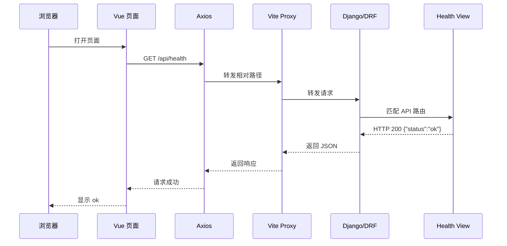

# Phase 1：个人技术知识库与智能问答基础版本

## 1. 阶段目标

本阶段不追求完整博客产品，只完成一条可演示、可解释的核心链路：

```text
管理员创建测试账号，用户登录
  -> 创建自己的文章草稿并提交审核
      -> 管理员审核通过
          -> embedding 成功
              -> Chroma 写入成功
                  -> 通过统一公开门禁后展示
                      -> 登录用户发表评论
                          -> 管理员审核评论
                              -> 通过后公开
                                  -> 用户提问
                                      -> GPT 返回带来源的回答
```

时间范围：2026 年 8 月 22 日至 8 月 28 日。

可投入时间约 38-52 小时，但只按约 25-32 小时的稳定产出安排，至少保留 30% 时间用于学习、排错、查文档和意外问题。

## 2. 本阶段范围

### 必须完成

- Django User/Session 登录和基础角色权限；不做公开注册
- 普通用户创建、编辑草稿、删除自己的文章
- 普通用户提交文章审核，不能直接公开
- 管理员审核、通过、驳回、下架和删除任意文章
- 文章标题、摘要和 Markdown 正文
- Vue 前台登录、文章列表、详情和作者文章管理入口
- 只有审核通过且索引成功的文章进入公开 API 和 Chroma
- 登录用户创建、删除自己的评论；评论不提供普通用户编辑
- 管理员审核、通过、驳回、下架和删除任意评论
- Vue 单轮问答页面
- 文章和评论审核结果的站内系统通知
- GPT 返回回答和引用文章片段
- 模型超时、无结果、权限失败和服务失败提示
- README 启动和配置说明

字段归属统一约定：`Article` 保存文章状态和索引生命周期字段，包括 `status`、`index_status`、`index_step`、错误信息、`content_hash`、`version` 和索引时间；`ArticleChunk` 只保存 `article_id`、`chunk_index`、清洗后的片段、`vector_document_id` 和时间字段，不重复保存文章状态。`article_id + chunk_index` 必须联合唯一。

### 本阶段不做

- 独立的 Vue 管理后台；管理员使用 Django Admin
- 复杂分页、高级搜索、分类筛选和标签筛选页面
- 点赞、收藏、邮件/短信通知和订阅
- Agent、多轮对话、流式输出
- Celery、Chroma HTTP Server 和异步索引
- 完整 Docker Compose 交付

分类和标签可暂时保留为模型字段，通过管理端维护，不单独开发复杂页面。

## 3. 功能实现说明

### 文章管理与审核

普通用户通过 Vue 和 REST API 管理自己的文章；管理员通过 Django Admin 管理所有文章和审核流程，不开发独立管理前端。

普通用户可以：

- 创建自己的文章草稿
- 编辑自己的草稿、删除自己的文章
- 提交自己的文章审核
- 查看自己的草稿和待审核状态；驳回内容不展示，用户只收到系统通知

管理员可以：

- 审核所有文章
- 通过、驳回、下架和删除任意文章
- 记录审核人、审核时间和处理原因
- 管理文章对应的索引状态

文章状态：

```text
draft          作者编辑中，仅作者可见
pending_review 已提交审核，等待管理员处理
indexing       管理员通过，正在执行 embedding 和 Chroma 写入
index_failed   embedding 或 Chroma 失败，不公开，等待管理员处理
published      管理员通过且索引成功，可公开展示和检索
offline        管理员下架，不公开、不检索；确认后硬删除
```

发布规则：

- 普通用户的“发布”表示提交审核，不能直接将状态改为 `published`。
- 管理员通过后先进入 `indexing`，只有 embedding 成功、Chroma 写入成功且 `index_status=indexed` 才进入 `published`。
- embedding 或 Chroma 任一步失败时，文章保持不公开，管理员可在 Django Admin 查看阶段、错误和重建索引入口；普通用户不接收技术错误。
- 管理员驳回文章时直接从数据库删除，并向作者创建站内系统通知；通知不展示被驳回正文。
- 已发布文章没有原地编辑；编辑入口执行确认删除旧文章并创建新草稿。
- offline 文章确认后直接从数据库删除，不提供恢复机制；删除时清理 ArticleChunk、Chroma 向量和关联评论。

### 前台文章展示

Vue 前台实现两个页面：

```text
/                    文章列表
/articles/{id}       文章详情
/my-articles         当前用户的文章管理
/knowledge            知识库问答
```

`/my-articles` 只展示当前登录用户的文章草稿、待审核和已发布文章，并提供创建、编辑草稿、删除和提交审核入口。管理员审核不在该页面实现，统一进入 Django Admin。

文章列表展示：

- 标题
- 摘要
- 发布时间
- 文章详情入口

文章详情展示：

- 标题
- Markdown 正文
- 发布时间
- 基础错误和空数据状态

文章列表和详情都必须调用统一公开门禁：`status=published AND index_status=indexed`。第一阶段不实现复杂分页、分类筛选和标签筛选。

访客读取链路统一为：

```text
Vue 页面
  -> Axios
      -> Django/DRF API
          -> 公开门禁查询 Article
              -> status=published + index_status=indexed
                  -> 返回文章
                      -> Vue 渲染
```

`/api/articles` 用于列表，`/api/articles/{id}` 用于详情：列表需要返回多个资源的摘要，详情需要返回单个资源的完整内容；两者复用同一个公开门禁，避免不同接口暴露不同状态的文章。

评论列表同样先检查文章公开，再检查 `comment.status=approved`；匿名用户只能读取，登录用户才能提交评论。

### 评论附属闭环

评论是文章公开主链路之后的附属闭环，不能阻塞文章发布、索引和知识问答：

```text
公开文章
  -> 登录用户提交评论
      -> pending_review
          -> 管理员审核
              -> approved：文章公开且评论公开
              -> 驳回动作：评论直接删除，并向作者发送站内通知
```

- 匿名用户只能读取公开文章和已通过评论，不能提交、修改或删除评论。
- 普通用户只能删除自己的评论；评论提交后不提供普通用户编辑。
- 管理员只能通过 Django Admin 审核评论，不开发独立管理前端。
- 评论审核失败、删除和下架不影响文章公开、索引或问答。

删除入口按权限和状态显示：匿名用户、非作者普通用户不显示删除按钮；作者只看到自己且当前允许删除的文章或评论的删除入口；管理员在 Django Admin 中看到全量删除操作。前端隐藏入口不等于授权，后端仍必须执行最终权限校验。

删除接口统一执行以下后端链路：

```text
登录认证
  -> 查询资源是否存在
      -> 校验作者身份或管理员权限
          -> 校验文章、评论、ArticleChunk 和 Chroma 的关联关系
              -> 清理 ArticleChunk 和 Chroma 向量
                  -> 硬删除数据库资源
```

删除文章时同时清理关联评论、文章片段和向量；删除评论时只删除该评论，不影响文章、其他评论和文章索引。资源不存在或无权限时不执行删除；跨用户资源按统一 `404` 处理。Chroma 清理失败时保留数据库资源并向管理员反馈，待清理成功后再完成硬删除。

### 知识库索引

本 Phase 的 embedding 使用本地模型 `BAAI/bge-small-zh-v1.5`，通过 `sentence-transformers` 加载，默认输出 512 维向量。文章片段入库和用户问题查询必须使用同一个模型；`MODEL_NAME` 只配置聊天模型，不能拿来当 embedding 模型。模型首次运行时会自动下载并缓存到本机，不把模型文件提交到 Git。

本 Phase 官方文档：

- [Sentence Transformers 使用文档](https://www.sbert.net/docs/sentence_transformer/usage/usage.html)：核对本地模型加载和批量 `encode`。
- [BAAI/bge-small-zh-v1.5 模型卡](https://huggingface.co/BAAI/bge-small-zh-v1.5)：核对中文模型、查询指令和 512 维输出。
- [Chroma Query and Get](https://docs.trychroma.com/docs/querying-collections/query-and-get)：核对向量查询参数和返回结构。

文章发布后建立索引：

```text
读取文章正文
  -> 清理 Markdown
      -> 按标题和段落切分
          -> 生成 embedding
              -> 写入 Chroma
                  -> 保存 ArticleChunk 映射
```

`index_status` 为必填字段，默认 `not_indexed`，不允许为空。至少使用：

```text
not_indexed -> indexing -> indexed
                    \-> failed
```

同时记录 `index_step`、`embedding_error`、`chroma_error`、`index_error` 和时间字段。管理员在 Django Admin 中可以看到“待开始、embedding 中、Chroma 写入中、成功、失败”的明确进度。

索引失败不通知普通用户；管理员通过 Admin 提示、错误字段和日志获得反馈。重建索引使用同一个后端 service，并提供 Django Admin 操作和 `manage.py rebuild_article_index` 管理命令，不依赖独立可视化后台。重建条件包括索引失败、索引过期、模型配置变更、Chroma 文档缺失或 ArticleChunk 映射不一致。

索引服务放在 `knowledge/services.py`，模型调用放在 `knowledge/llm.py`，避免把 RAG 逻辑堆到接口视图中。

### 知识库问答

Vue 问答页面：

```text
/knowledge
```

问答接口无需登录即可调用。匿名访客和普通登录用户都只能检索通过公开门禁的文章；登录不会扩大知识库可见范围，接口也不允许写入文章、评论或其他数据。

页面包含：

- 问题输入框
- 提交按钮
- loading 状态
- 回答区域
- 来源文章标题
- 引用片段
- 无结果和错误提示

问答流程：

1. 校验问题不能为空。
2. 使用与文章入库相同的 embedding 模型处理问题。
3. 从 Chroma 检索相关片段。
4. 根据相似度阈值过滤结果。
5. 限制传给 GPT 的片段数量和总长度。
6. 要求 GPT 只基于检索内容回答。
7. 返回回答和来源。

问答接口允许匿名用户访问。检索范围只包含通过公开门禁的文章：`status=published AND index_status=indexed`。返回结构必须同时包含回答和来源文章/片段；草稿、待审核、索引失败、offline 或已删除内容不能参与检索，也不能出现在 `sources` 中。登录不会扩大问答检索范围。

没有达到阈值的检索结果时，直接返回“知识库中没有找到相关内容”，不要求模型自由发挥。

## 4. 技术选型

本阶段遵循[项目开发规范](../docs/development-specification.md)中的总体技术栈、组件边界、数据流、API 和安全约定。

Phase 1 的实现子集为：

- 后端：Python、Django、Django REST Framework
- 内容管理：Django Admin
- 前端：Vue 3、Vite、Vue Router、Axios
- 数据库：SQLite，使用 Django migrations 创建表结构，不提交数据库文件
- 向量库：Chroma PersistentClient，本地单进程使用
- Embedding：本地 `SentenceTransformers` + `BAAI/bge-small-zh-v1.5`
- 聊天模型：OpenAI-compatible SDK/API
- 测试：pytest、pytest-django
- 运行方式：本地启动优先；接入 Chroma 后使用 `python manage.py runserver --noreload`

使用 Django Admin 是为了缩小第一周范围，同时保留 Django、Vue、API 和 RAG 的学习价值。自定义管理后台放到后续阶段。Phase 1 暂不强制引入 Pinia、Redis、Celery 或完整 Docker Compose。

## 5. 自顶向下设计

### 架构、目录和 API 契约

本阶段遵循[项目开发规范](../docs/development-specification.md)中的总体架构、组件分层、目录职责、数据模型和 API 契约。Phase 1 只实现其中的 MVP 子集：

- 使用 Django + DRF 提供 API 和 Django Admin。
- 使用 Vue + Vite 提供文章列表、详情和问答页面。
- 使用 SQLite 保存业务实体，使用本地 Chroma PersistentClient 保存向量。
- 公开 API 只返回通过统一公开门禁（`status=published AND index_status=indexed`）的文章。
- 问答接口返回回答和来源片段，并处理无结果、超时和模型失败。

详细的系统架构图、组件职责、目录建议、API 请求/响应结构和错误格式只在项目开发规范中维护，避免 Phase 1 文档与项目规范出现两份技术权威。

## 6. 数据模型

数据模型、生命周期和权限字段以[项目开发规范](../docs/development-specification.md)为准。Phase 1 至少实现：

- User：Django User/Session、角色和基础权限。
- Article：作者、草稿、待审核、索引中、索引失败、公开、下架和必填索引状态。
- Comment：文章、作者、评论内容、审核状态和审核审计字段。
- ArticleChunk：文章片段与 Chroma 文档映射。
- `article_id + chunk_index` 联合唯一约束。

普通用户只能操作自己的 Article/Comment；管理员可以操作全量内容。Phase 1 使用 Django migrations 创建表结构，不提交 SQLite 数据库文件。

## 7. Phase 1 必须处理的风险

### Chroma

本阶段使用本地 PersistentClient，开发时使用：

```text
python manage.py runserver --noreload
```

避免自动重载或多个进程同时写入向量文件。索引失败要捕获并记录日志。Chroma HTTP Server 放到 Phase 2。

### 同步索引

第一周允许发布后同步索引，但必须有：

- 分批 embedding
- 请求超时
- 基础重试
- 错误日志
- 前端处理中和失败提示

大文章导致发布变慢是已知技术债务，Phase 2 再使用 Celery 异步处理。

### RAG 约束

- 段落优先切分
- 标题保留在片段元数据中
- 代码块尽量整体处理
- 使用 chunk overlap
- 入库和查询使用同一个 embedding 模型
- 默认使用本地 `BAAI/bge-small-zh-v1.5`，输出 512 维向量
- `EMBEDDING_PROVIDER=local` 时不调用远程 embedding API；聊天模型仍使用 `MODEL_NAME`
- 设置相似度阈值
- 限制检索片段数量和上下文长度
- 无片段达到阈值时明确返回没有找到相关内容

建议配置：

```text
CHUNK_SIZE
CHUNK_OVERLAP
EMBEDDING_BATCH_SIZE
SIMILARITY_THRESHOLD
MAX_RETRIEVED_CHUNKS
MAX_CONTEXT_CHARS
LLM_TIMEOUT_SECONDS
```

### 模型和前端异常

后端捕获 API Key 错误、网络超时、模型不可用、embedding 失败、空响应和上下文超限。前端显示 loading、防重复提交、网络错误、模型错误和无结果状态。本地模型还要记录首次下载耗时和 CPU 推理耗时；切换 embedding 模型后必须重建 Chroma 索引。

## 8. 一周计划

本计划从 2026 年 8 月 22 日（周六）重新开始，到 8 月 28 日（周五）结束。昨天未完成的内容不再追赶，今天按 Day 1 执行。

工作日每天安排约 4-5 小时确定工作，剩余时间用于学习、排错和意外问题。周日安排 5-6 小时核心工作，最多使用 1-2 小时处理可选任务或当天遗留问题。

### 8 月 22 日，周六：需求、架构和项目骨架

目标：完成从零开发前必须确定的设计，并让空项目可以运行。

- [ ] 确认基础版本的核心闭环和不做清单
- [ ] 画系统架构图和文章到问答的数据流图
- [ ] 确认 Django Admin + Vue 前台架构
- [ ] 确认 `articles`、`knowledge` 模块职责
- [ ] 确认 Article、ArticleChunk 的最小字段
- [ ] 确认文章列表、详情、问答三个 API
- [ ] 创建 Django、Vue、Vite 项目骨架
- [ ] 完成 `GET /api/health`
- [ ] 提交架构文档和第一次 Git commit

完成标准：架构图、数据流图和 API 清单完成；Django 与 Vue 可以启动；浏览器可以显示 health API 返回的 `ok`。

#### Day 1 Health 完整链路

Health 只验证前后端请求链路，不携带用户数据，不连接业务基础设施。



失败链路：

```text
停止 Django -> Vite Proxy 连接失败 -> Axios error -> Vue 显示失败状态
```

Health 不经过：SQLite、User、Session、Article、Comment、ArticleChunk、Django Admin、Chroma、embedding 和 GPT。

详细执行步骤见：[Day 1 详细执行文档](./day1.md)。

### 8 月 23 日，周日：文章模型和 Django Admin

目标：在实际创建文章的过程中学习 Django Model、Migration 和 Admin。安排 5-6 小时核心工作，剩余 1-2 小时用于准备数据、排错和顺延问题。

核心任务：

- [ ] 创建 Article 和 ArticleChunk 模型
- [ ] 使用 Django migration 创建 SQLite 表
- [ ] 为 Article 配置草稿和发布状态
- [ ] 增加 ArticleChunk 联合唯一约束
- [ ] 配置 Django Admin
- [ ] 创建管理员账号
- [ ] 在 Admin 中创建、编辑和发布文章

- [ ] 准备 3-5 篇真实技术文章
- [ ] 验证草稿和已发布文章状态

完成标准：可以通过 Django Admin 管理文章，数据库中有可用于前台和 RAG 的真实数据。

建议时间分配：

1. 1 小时：学习 Django Model、Migration 和 Admin 的当前用法。
2. 2-3 小时：创建模型、执行迁移和配置 Admin。
3. 1-2 小时：创建管理员、录入文章并验证草稿/发布状态。
4. 剩余时间：处理报错，或提前整理周一文章 API 所需的字段。

如果模型或 Admin 遇到问题，优先完成模型、迁移和 Admin；文章数据准备可以顺延到周一。

### 8 月 24 日，周一：文章 API 和 Vue 前台

目标：完成公开文章接口，并在真实页面中学习 Vue、Vite、Router 和 Axios。

- [ ] 实现 `GET /api/articles`
- [ ] 实现 `GET /api/articles/{id}`
- [ ] 只返回已发布文章
- [ ] 处理文章不存在和空数据
- [ ] 创建首页文章列表
- [ ] 创建文章详情页
- [ ] 接入 Axios 请求
- [ ] 展示标题、摘要、Markdown 正文和发布时间
- [ ] 增加 loading、空数据和错误状态

完成标准：浏览器可以查看已发布文章。分页、搜索和分类筛选暂不做。

### 8 月 25 日，周二：前台稳定和索引准备

目标：完成文章展示闭环，并准备知识库索引所需的基础服务。

- [ ] 修复文章 API 和前台联调问题
- [ ] 完善 Markdown 展示和基础样式
- [ ] 配置聊天模型环境变量（`MODEL_NAME`、`MODEL_API_KEY`、`MODEL_BASE_URL`）
- [ ] 安装 `sentence-transformers` 并配置本地 embedding（`EMBEDDING_PROVIDER=local`、`EMBEDDING_MODEL=BAAI/bge-small-zh-v1.5`）
- [ ] 首次下载并验证本地模型输出 512 维向量
- [ ] 实现 Markdown 基础清理
- [ ] 实现段落优先切分和 chunk overlap
- [ ] 确认 Chroma 持久化目录
- [ ] 配置 `ArticleChunk` 与文章的关联
- [ ] 记录索引失败和模型调用错误

完成标准：文章前台稳定，索引所需的配置和服务边界明确。

### 8 月 26 日，周三：Chroma 索引和检索

目标：让文章可以被检索，不急于接入复杂 Agent。

- [ ] 使用 `python manage.py runserver --noreload`
- [ ] 使用本地 BGE 模型实现 embedding 分批调用
- [ ] 设置请求超时和基础重试
- [ ] 将文章片段写入 Chroma
- [ ] 实现文章重复索引前的清理
- [ ] 实现文章删除或取消发布后的清理
- [ ] 实现问题向量化
- [ ] 实现相似度检索和阈值过滤
- [ ] 限制检索片段数量和上下文长度
- [ ] 用 3-5 篇文章手工验证召回结果
- [ ] 验证文章入库和问题查询使用同一个本地 embedding 模型

完成标准：可以通过代码检索出与问题相关的文章片段。索引同步执行是已知技术债务，不在本周引入 Celery。

### 8 月 27 日，周四：单轮知识库问答

目标：完成基础版本的核心 AI 闭环。

- [ ] 编写只基于检索内容回答的系统提示词
- [ ] 实现 GPT 调用封装
- [ ] 实现 `POST /api/knowledge/chat`
- [ ] 返回回答和来源文章、引用片段
- [ ] 创建知识库问答页面
- [ ] 增加 loading 和防重复提交
- [ ] 增加模型超时、网络错误和空回答提示
- [ ] 增加无检索结果提示
- [ ] 测试有答案、无答案和模型失败问题

完成标准：可以针对已发布文章提问，并得到带来源的回答。

### 8 月 28 日，周五：缓冲、测试和文档

目标：优先修复问题和完成交付，不默认增加新功能。

- [ ] 完整复测 Admin 创建文章、前台展示、索引和问答
- [ ] 补充文章 API 和问答接口测试
- [ ] 验证 API Key 不进入前端和 Git
- [ ] 修复前几天遗留问题
- [ ] 编写 README 启动和配置说明
- [ ] 记录同步索引、SQLite 和本地 Chroma 的技术债务
- [ ] 主流程稳定后再尝试 Docker

当天至少保留一半时间作为缓冲。若前面延期，周五只保核心链路和评论附属闭环，不补分页、搜索、分类或其他可选功能。

## 9. 验收标准

- [ ] 测试用户可以登录和退出，Session/Cookie 与 CSRF 配置正确；不实现注册
- [ ] 普通用户可以创建、编辑草稿、删除自己的文章，但不能操作他人文章
- [ ] 普通用户提交文章后必须进入待审核状态，不能直接公开
- [ ] 管理员可以对所有文章执行通过、驳回、下架和删除，并记录审计信息
- [ ] 只有审核通过、embedding 成功且 Chroma 写入成功的文章出现在公开 API 和知识库
- [ ] 本地 `BAAI/bge-small-zh-v1.5` 可以生成 512 维向量，文章入库和问题查询使用同一模型
- [ ] 登录用户可以创建和删除自己的评论；匿名用户只能阅读评论
- [ ] 管理员可以审核、下架和删除任意评论，驳回内容直接删除
- [ ] 文章和评论审核结果可以生成站内系统通知；索引技术错误只反馈管理员
- [ ] 普通用户不能修改 author、status、审核人、索引状态或角色权限字段
- [ ] Vue 前台可以查看已公开文章和已通过评论
- [ ] 用户可以提问并得到来源回答
- [ ] 无相关内容时不会强行编造
- [ ] 模型、索引和权限失败时页面有明确提示
- [ ] README 可以指导本地启动

没有注册、复杂搜索、点赞收藏、邮件/短信通知、Celery、Agent、多轮、流式或完整 Docker，不影响本阶段完成；站内审核结果通知属于本阶段范围。

## 10. 进度降级规则

按以下顺序削减：

1. 删除 Docker，保留本地启动。
2. 删除分页和搜索，只保留文章列表。
3. 删除分类和标签展示。
4. 将自动索引改为手动管理命令。
5. 保留文章展示、文章索引和单轮问答。

## 11. 后续 Phase 预留内容

- Vue 自定义管理员审核台
- Celery 异步索引
- Chroma HTTP Server 或 PostgreSQL/pgvector
- RAG 自动评估和检索指标
- AI 摘要、标签和润色（只能生成草稿或待审核内容）
- Agent 工具调用（不能绕过权限和审核）
- 多轮对话和流式输出
- Docker 多服务和监控
- 点赞、收藏、通知、订阅和推荐
